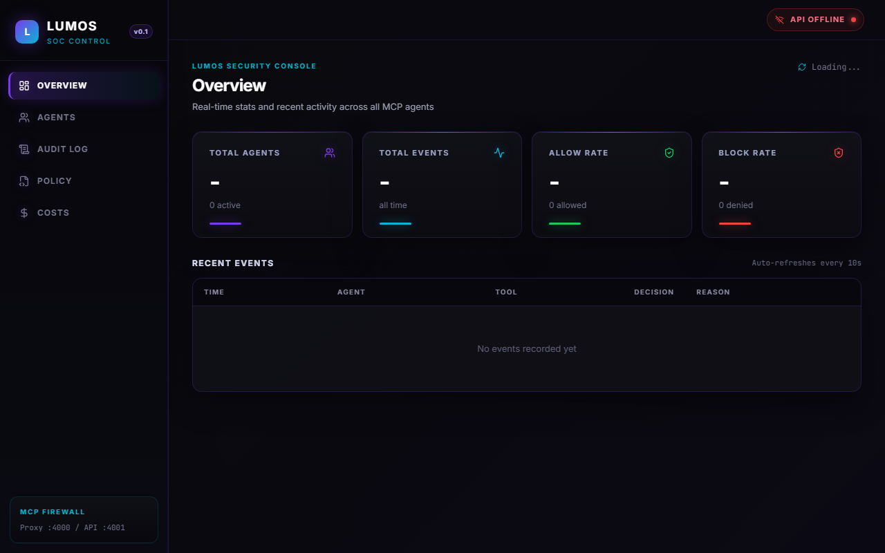
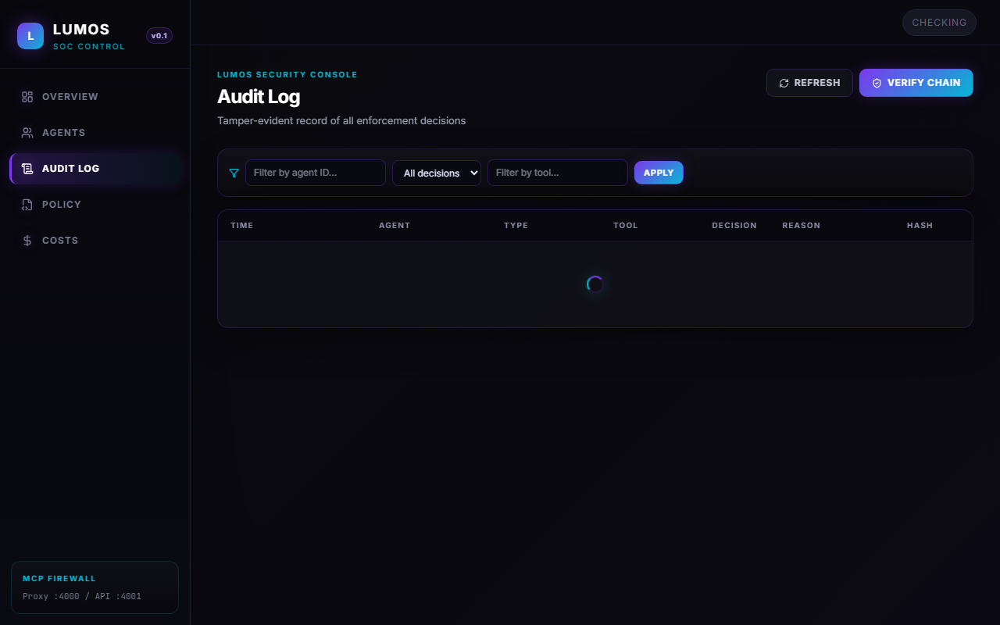
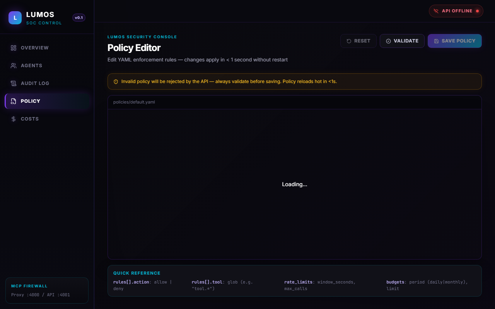
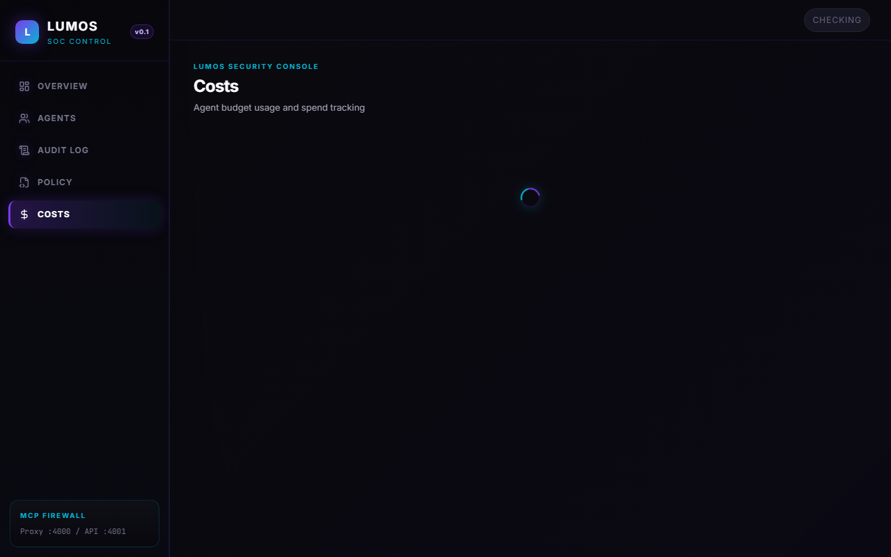

# 🔦 Lumos

**The open-source AI Action Firewall for MCP agents.**


> Your AI agent can call tools. Lumos decides if it should.

Lumos is a transparent reverse proxy that sits between AI agents and MCP tool servers. Every tool call is intercepted, cryptographically validated, evaluated against YAML policy rules, and logged to a tamper-evident Merkle audit trail — before the tool server ever sees the request.

No changes to your agent code. No changes to your tool server. One Docker command.

---

## The Problem

AI agents with tool access can take actions their users never intended. There is no standard enforcement layer in MCP. If your agent can call `delete_file`, it will call `delete_file`. Lumos fixes this at the transport layer.

---

## How It Works
Your AI Agent (Claude Desktop / Cursor / Windsurf)
│
▼
┌─────────────────────────────────────┐
│            Lumos Proxy              │
│                                     │
│  1. Validate capability token (DB)  │
│  2. Evaluate YAML policy            │
│  3. Allow or Block                  │
│  4. Log to Merkle audit trail       │
└──────────────┬──────────────────────┘
│
┌───────┴───────┐
▼               ▼
MCP Tool Server   Blocked Response
(allowed calls)   (denied calls)

---

## Dashboard

Lumos ships with a full management dashboard.






---

## Quickstart

### 1. Clone and configure

```bash
git clone https://github.com/keeertu/lumos
cd lumos
cp .env.example .env
# Set LUMOS_ADMIN_TOKEN to a secret value
```

### 2. Start the stack

```bash
docker compose -f docker/docker-compose.yml up -d
docker compose -f docker/docker-compose.yml ps
```

### 3. Initialise the database

```bash
curl -X POST http://localhost:4001/internal/db/init \
  -H "Authorization: Bearer your-admin-token"
```

### 4. Register an agent

```bash
curl -X POST http://localhost:4001/v1/agents \
  -H "Authorization: Bearer your-admin-token" \
  -H "Content-Type: application/json" \
  -d '{"agent_id": "my-agent", "display_name": "My First Agent"}'
```

### 5. Point your MCP client at the proxy

**Claude Desktop** — edit `~/Library/Application Support/Claude/claude_desktop_config.json`:

```json
{
  "mcpServers": {
    "my-server-via-lumos": {
      "url": "http://localhost:4000/proxy",
      "headers": {
        "x-lumos-agent-id": "my-agent"
      }
    }
  }
}
```

**Cursor / Windsurf** — use the same proxy URL in your MCP server config.

### 6. Start the dashboard

```bash
cd dashboard
npm install
npm run dev
# → http://localhost:5174
```

### 7. Write a policy

Edit `policies/default.yaml`:

```yaml
rules:
  - name: block-delete-tools
    tool: "tool.delete*"
    action: deny
    reason: "Deletion tools are blocked by policy"

  - name: allow-everything-else
    tool: "*"
    action: allow

rate_limits:
  "*":
    window_seconds: 60
    max_calls: 100

budgets:
  "*":
    period: daily
    limit: 1000
```

Policy hot-reloads in under 1 second. No restart needed.

---

## API Reference

| Method | Path | Description |
|--------|------|-------------|
| GET | `/health` | Health check |
| POST | `/v1/agents` | Register agent |
| POST | `/v1/agents/{id}/keys` | Add Ed25519 key |
| POST | `/v1/auth/nonce` | Get auth nonce |
| POST | `/v1/auth/session` | Create session |
| POST | `/v1/capabilities` | Issue capability token |
| GET | `/api/events` | List audit events |
| GET | `/api/agents` | List agents with stats |
| GET | `/api/stats/summary` | Dashboard summary |
| GET | `/api/stats/costs` | Budget usage |
| GET | `/api/policy` | Get current policy |
| PUT | `/api/policy` | Update policy |
| GET | `/api/audit/verify` | Verify Merkle chain integrity |

All endpoints except `/health` and `/v1/auth/nonce` require `Authorization: Bearer <admin-token>`.

---

## What's Implemented

- Ed25519 cryptographic agent identity
- Nonce-based challenge-response auth (replay-resistant)
- Session JWTs + capability JWTs (EdDSA signed, short-lived)
- DB-backed fail-closed token validation
- MCP JSON-RPC 2.0 proxy (HTTP transport)
- YAML policy engine with hot reload (< 1s)
- 10 argument matchers (equals, not_equals, contains, regex, gt, lt, in, …)
- DB-backed rate limiting (fixed window, per agent and per tool)
- DB-backed budget enforcement (daily/monthly, strict reservation)
- Async audit trail with automatic PII redaction
- Tamper-evident Merkle SHA-256 hash chain
- Expiry sweeper (sessions, capabilities, nonces)
- REST API (18+ endpoints)
- Docker Compose full stack
- React dashboard (Overview, Agents, Audit Log, Policy Editor, Costs)

## What's Not Implemented Yet

- CLI tool
- STDIO transport (for local MCP servers)
- SSE transport (for streaming MCP clients)
- Multi-tenant / organisation model
- Automated key rotation
- Production load testing

---

## Build Status

| Phase | Description | Status |
|-------|-------------|--------|
| 1 | Data layer (PostgreSQL schema, models, repositories) | ✅ Complete |
| 2 | Identity + auth (Ed25519, nonce, sessions, capabilities) | ✅ Complete |
| 3 | Enforcement endpoint (`/v1/enforce`) | ✅ Complete |
| 4 | Proxy core (MCP interception, forwarding, audit queue) | ✅ Complete |
| 5 | Policy engine (YAML, matchers, rate limits, budgets, PII) | ✅ Complete |
| 6 | Merkle audit chain + expiry sweeper | ✅ Complete |
| 7 | REST API + Docker | ✅ Complete |
| 8 | Dashboard UI | ✅ Complete |

---

## Running Tests

```bash
docker compose -f docker-compose.test.yml up -d
pytest tests/ -v
```

Expected: 79+ tests passing.

---

## Architecture
┌─────────────────┐     ┌─────────────────┐
│   Lumos API     │     │  Lumos Proxy    │
│   port 4001     │     │   port 4000     │
│                 │     │                 │
│  Identity mgmt  │     │  MCP intercept  │
│  Token issuance │     │  Policy enforce │
│  REST API       │     │  Audit queue    │
└────────┬────────┘     └────────┬────────┘
│                       │
└──────────┬────────────┘
│
┌─────────▼─────────┐
│    PostgreSQL      │
│  (TimescaleDB)     │
│                   │
│  agents            │
│  agent_keys        │
│  sessions          │
│  auth_nonces       │
│  capabilities      │
│  audit_events      │◄── Merkle chain
│  rate_limit_state  │
│  budget_state      │
└───────────────────┘

---

## Contributing

PRs welcome.

```bash
# Dev setup
git clone https://github.com/keeertu/lumos
cd lumos
python -m venv venv && source venv/bin/activate
pip install -r requirements.txt
docker compose -f docker-compose.test.yml up -d
pytest tests/ -v
```

For security issues, open a private GitHub issue.

---

## License

MIT

---
Built with 🔦 by [keeertu](https://github.com/keeertu) and [Ayaan1911](https://github.com/Ayaan1911).
